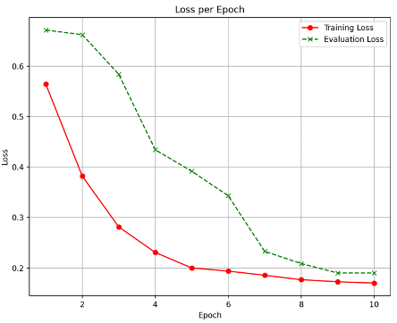
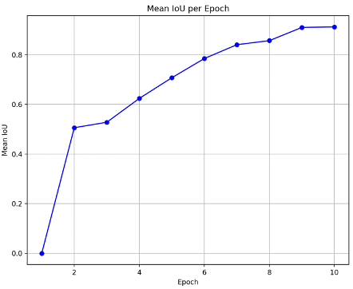
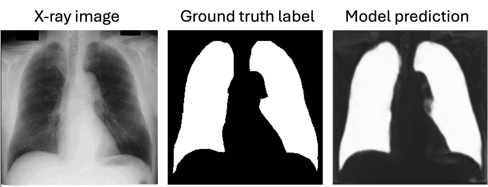

# Lung Segmentation from Chest X-rays Using PyTorch

This project implements a convolutional neural network (UNet) for automatic **lung field segmentation** from chest X-ray images using **PyTorch**. It includes model training, evaluation with IoU (Jaccard Index), and visualization of performance metrics.

## Directory Structure

```
data/
├── list_train.txt           # Paths to training images and masks
├── list_test.txt            # Paths to test images and masks
├── train/
│   ├── org/                 # Original chest X-ray images
│   └── label/               # Binary lung masks
└── test/
    ├── org/
    └── label/
train.py                     # Main training & evaluation script
```

## Requirements

* Python 3.7+
* PyTorch
* torchvision
* scikit-learn
* matplotlib
* tqdm
* Pillow

Install with:

```bash
pip install -r requirements.txt
```

> You may need to create a virtual environment and activate it before installing.

## Training

To start training and evaluation:

```bash
python train.py
```

The script trains the model using **Binary Cross Entropy (BCE)** loss and evaluates using **Intersection over Union (IoU)** at the end of each epoch.

### Sample Output Plots

#### Training Loss vs. Epoch



#### IoU Score vs. Epoch



These plots are saved automatically in the `plots/` directory (make sure it exists).

## Model

The model is a UNet CNN built for 1-channel (grayscale) input. You can easily replace it with a multi-channel one.



## Notes

* Images and masks must be grayscale.
* Resize dimensions can be adjusted in the transform pipeline (`train.py`).

## Dataset

The dataset used for training and testing is sourced from the Japanese Society of Radiological Technology (JSRT).
- Link: [JSRT Database](http://db.jsrt.or.jp/eng.php)

## License

MIT License. See `LICENSE` file for details.
